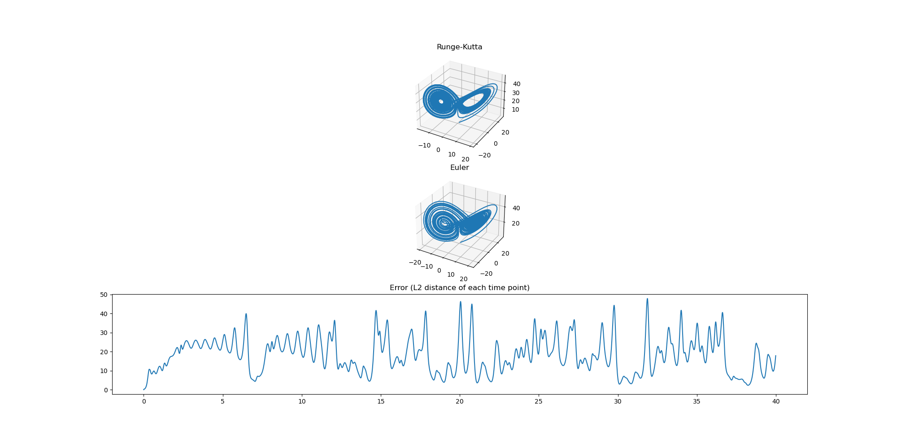

# Comparing Lorenz attractor simulation between using Runge-Kutta and Euler's method

I was just curious Lorenz attractor can be simulated with simple first order ODE integrator (Euler's method).
The example in [Wikipedia page](https://en.wikipedia.org/wiki/Lorenz_system#Python_simulation) uses Runge-Kutta solver, which is a 4th order ODE integrator.
I simply changed the solver to Euler's method, and observed what difference it makes.

As expected, Euler's method do not give accurate results and errors are quite high even when fine time delta is given (t=0 to t=40 with time delta 0.01, 0.001, 0.0001. The figure shows when delta is 0.01). An interesting thing is that while Euler method is not accurate, its solution does not diverge. Therefore, for visual and entertainment purposes, using Euler's method may be acceptable, as in clothes simulation. (A lot of clothes simulations for 3D animation are based on first-order approximation). 

Runge-Kutta shows accurate results even when simulated time points are far away, where Euler's method fails (t=0 to t=40 with time delta 0.1). 

Future: How can I prove the Euler method's stability given time delta and ODE?

